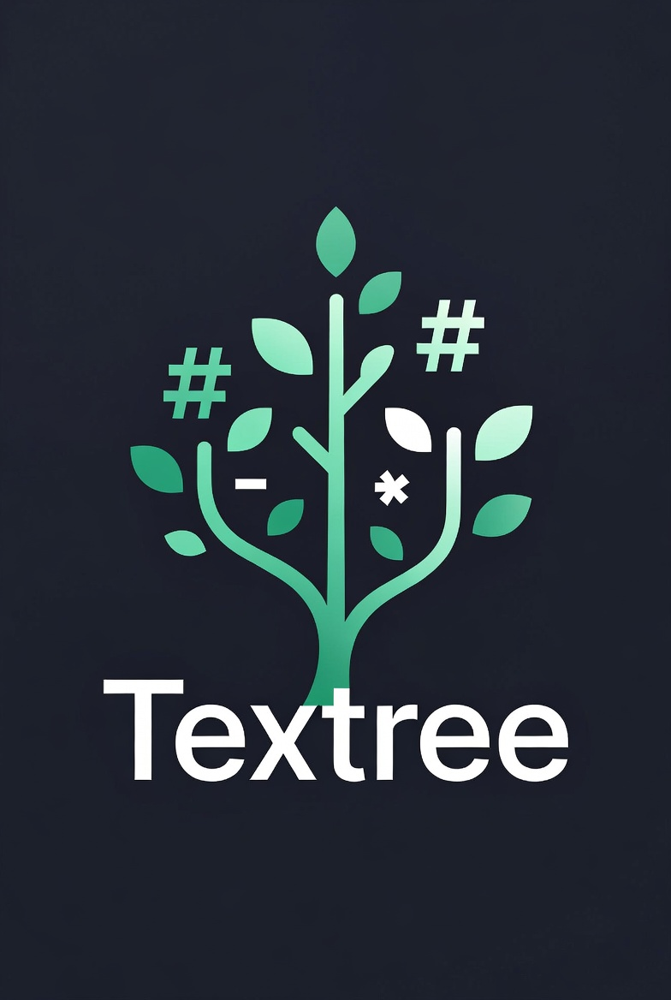

<p align="center">
  
</p>

# Textree

> A pretty, free, local-first note app — polished notes with full ownership, living directly on your filesystem.

**Textree** gives you tidy, good-looking notes **by default**, a tree that mirrors your folders, and **one-click web publishing** — all as plain `.md` files on your own disk.
There is no separate database and no cloud lock-in: **the local filesystem itself is the single source of truth**.
The tree view on the left maps to your folder structure, and the editor on the right syncs **bidirectionally, 1:1** with the underlying markdown files.

Your notes are not trapped in some cloud table. They sit right on your disk, as ordinary `.md` files.

---

## Why Textree

**Text** — pure, unprocessed text. Not bound to any database; an `.md` file that opens in Notepad even after you delete the app.
**Tree** — mirrors your filesystem's folder/directory tree. Scattered notes grow into a single tree of knowledge.

True to its name, Textree is **plain text on top of a tree-structured filesystem** — combining no-code databases and a tidy result with local files, full ownership, and portability, on a single-user, offline, MIT core that is **free forever**.

---

## What makes it different

Three things Textree leans into from the start:

- **Pretty by default** — opinionated defaults (title, an emoji icon, a typographic scale, consistent spacing) so a note looks tidy *without* you styling anything. No paid tier to unlock polish, no theming homework — Textree just looks reasonable out of the box.
- **Free local AI** *(planned)* — a small local model by default, with graceful degradation: editing, the tree, and search all work fully without it. Elevate with your own API key (or an OpenAI-compatible endpoint) when you want more. No mandatory subscription to make AI useful.
- **Frictionless publish** — turn your tree into a clean, read-only static website in one move (via [canopy](https://github.com/iyulab/canopy)). Local notes, on the web, without surrendering the local-source-of-truth model.

> The folder tree is a **structural principle** — the basis for scope and organization — not a feature sold on its own.

---

## Core Philosophy

1. **The filesystem is the database.**
   No hidden DB, no proprietary format. Folders are folders, notes are `.md` files. (Indexes are regeneratable caches, never the source of truth.)
2. **Full ownership.**
   Delete the app and your data remains. Open it with VS Code, `vim`, or `cat` — it just reads.
3. **Offline-first, privacy-first.**
   Works without a network; your data never leaves your machine.
4. **Bidirectional live sync.**
   Edit a file in an external editor and the app reflects it instantly; edit in the app and it writes to disk instantly. On conflict, **the filesystem always wins.**
5. **No lock-in.**
   You can pick up your folder and leave at any time.
6. **Configuration-minimal.**
   Sensible defaults work immediately; settings reveal themselves only when you need them (progressive disclosure) — the expressiveness of a power tool with a no-setup start.

---

## Filesystem Mapping Model

Every Textree operation reduces to a single rule: **a tree node is a filesystem entry.**

| Textree concept       | Filesystem counterpart                  |
| --------------------- | --------------------------------------- |
| Workspace (Vault)     | A root folder you choose                 |
| Note without children | A `note.md` file                         |
| Note with children    | A `note/` folder + a `note.md` inside it |
| Sub-note              | An `.md` file / subfolder inside the parent folder |
| Attachment (images…)  | Stored in the same folder + linked via a relative markdown path |
| Tree sort order       | `.textree/order.json` (optional metadata) |

### Example

```
my-vault/
├── project.md                  ← leaf note (no children)
├── journal/                     ← note with children
│   ├── journal.md               ← body of the "journal" note
│   ├── 2026-06-13.md
│   └── 2026-06-12.md
└── library/
    ├── library.md
    ├── meeting-notes.md
    └── assets/
        └── diagram.png          ← referenced from meeting-notes.md via 
```

> **Design decision — the "folder note" pattern**
> Many note apps let a page have *both* body content *and* sub-pages.
> A pure filesystem has no "node that has both content and children", so
> Textree expresses this with the **`folder-name/folder-name.md`** convention.
> Leaf notes stay as plain `.md` files, keeping 100% compatibility with ordinary markdown tools.
> (An `index.md` convention is also possible — selectable in settings, planned.)

---

## Features

### Editing & navigation

- Markdown editor with live preview (CodeMirror 6)
- Real-time, bidirectional sync between your folders and the tree view (file watcher)
- Create / rename / move / delete / promote notes → reflected on the filesystem instantly
- Drag-and-drop tree reordering
- Paste an image → stored locally + linked via a relative path
- Full-text search (local index, no DB) and a unified command palette / quick switcher
- Dark/light theme, keyboard navigation, accessibility (ARIA)

### Pretty by default

- **Frontmatter page header** — `title` + emoji `icon` render as a tidy page header above the editor; the raw YAML folds into a compact "properties" pill while you edit (the source `.md` is never rewritten)
- **Opinionated typography** — a modular heading scale (h1–h6) with spacing-token vertical rhythm, so an unstyled note looks tidy by default
- **Reading view** — a one-toggle, clean read-only render (all markdown markers hidden, frontmatter folded)
- **Favorites** — star a note straight from the tree; favorites surface in the tree and at the top of the command palette

### Wikilinks & vault interoperability

- **Wikilinks** — `[[note]]`, aliases `[[note|label]]`, headings `[[note#heading]]`, block anchors `[[note#^id]]` (standard wikilink syntax); rendered in live preview, click to navigate, with `[[` autocomplete
- **Backlinks** — a panel listing every note that links to the current one
- **Vault interoperability** — open a standard `.md` vault as-is; foreign sidecar folders (e.g. `.obsidian/`) and `.canvas` files are left untouched, and editing is byte-lossless (CRLF line endings are preserved), so two apps can take turns on the same vault
- **Sync-folder safety** — atomic writes stage in `.textree/tmp/` (out of your content folders, swept on open) so a sync client isn't churned by transient files; and conflicted copies a sync tool leaves behind (Dropbox / Syncthing) are surfaced non-destructively — nothing is changed or deleted, so a divergent edit isn't silently lost

### Frontmatter database

- **Table view** — select a folder to see its child notes as a table: frontmatter keys become sortable columns, one row per note (folder = database, `.md` = row). Built in memory from the notes themselves — no separate database
- **Filters & saved views** — filter rows by a field (contains / is / exists / missing), then save the lens as a named view per folder. Views persist to `.textree/views.json` (a regeneratable sidecar — the `.md` frontmatter stays the source of truth). The table is a read-only lens

### Publishing

- **Static-site publishing** via [canopy](https://github.com/iyulab/canopy) (a separate MIT tool) — `npx canopy build <vault>` turns your tree into a deployable, read-only static site today (self-host on GitHub / Cloudflare Pages). One-click in-app publish (rendering via canopy with the app's theme) is being wired into packaged builds.

---

## Roadmap

Directions, not promises — the local, single-user core stays free and works without any of these:

- **Free local AI + bring-your-own key** — a local model by default (graceful degradation), cloud elevation with your own API key or OpenAI-compatible endpoint
- **Tree-scoped AI** — search and writing scoped by where you are in the tree; an amplification layer you see and click to control
- **Cover banners & image icons** — pending the Tauri asset protocol (today: text/emoji icons render; image-based ones are skipped)
- **Richer block editing** — slash commands, board & calendar views, inline cell editing

---

## Where Textree fits

Textree trades real-time collaboration for **ownership, portability, and transparency** — then adds pretty-by-default and one-click publish on top. Your notes stay as plain `.md` files on your own disk: fully yours, readable by any markdown tool, and available offline. A polished note app you actually own.

---

## Architecture

- **Shell:** [Tauri 2](https://tauri.app) — Rust backend + webview. Lightweight (~10MB-class install), fast file I/O.
- **Frontend:** Svelte 5 + TypeScript + Vite
- **Editor core:** [CodeMirror 6](https://codemirror.net) — live preview decorations
- **File watching:** Rust `notify` (+ debouncer)
- **Search:** Rust `tantivy` local index — no external DB required
- **Sidecar metadata:** `.textree/` (order.json, favorites.json, etc.) — travels with the vault

---

## Getting Started

```bash
git clone https://github.com/iyulab/textree.git
cd textree
npm install
npm run tauri dev      # development run
npm run tauri build    # production build
```

Requirements: Node 24+, Rust (stable). Windows/macOS/Linux desktop.

---

## License

MIT

---

*Textree — your notes, on your disk, as plain files.*
