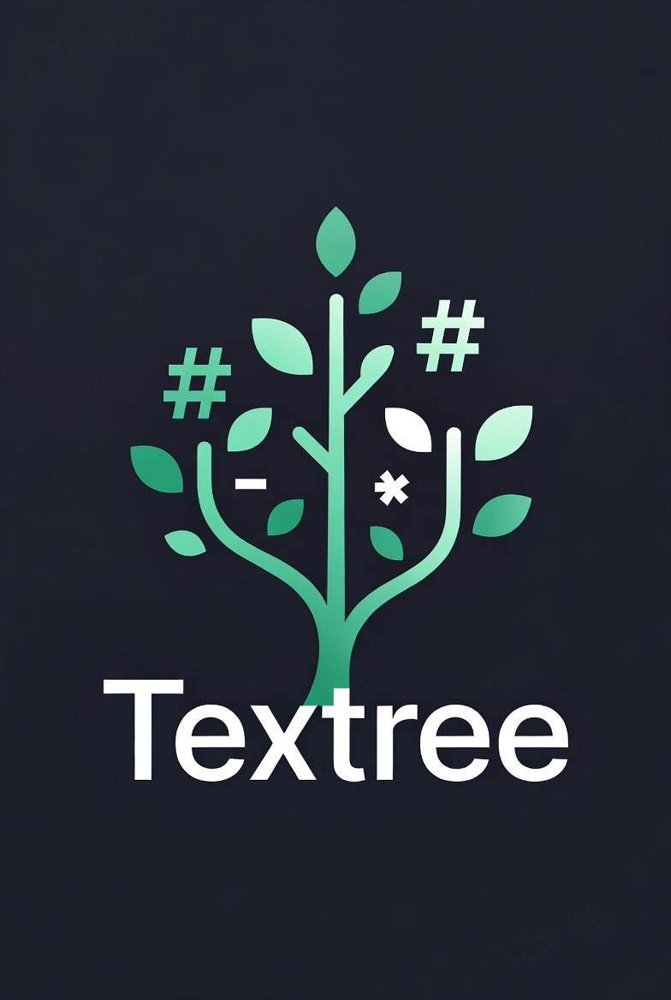

<p align="center">
  
</p>

# Textree

> A local Markdown notes app. Your notes stay plain `.md` files in a folder you choose — and every
> version you keep stays with them.

**Textree** is a desktop app for writing in plain Markdown files on your own disk. The tree on the
left is your folder; the editor on the right writes straight to the file. There is no database
and no account: close the app, and your notes are still ordinary files any editor can open.

What Textree adds on top of the files is a memory of them. Keep a version of a note when it
matters, go back to any earlier one, and bring back anything you deleted — all without a single
extra file appearing in your folder.

---

## What it does

### Write in your own folder

- Open any folder of `.md` files, or start in a fresh one — no setup, no sign-in.
- The tree mirrors your folders; create, rename, move, and delete notes, and it happens on disk.
- Edit a note in another editor and Textree picks up the change; conflicting edits are never
  silently overwritten — you choose which version stays.
- Live-preview Markdown editing, full-text search, a command palette, light and dark themes.

### Keep versions, and go back

- **Add version** — keep the state of a note, with an optional name (`Ctrl+Shift+S`).
- **Version history** — every version you kept, newest first. Open one to read it, or go back to
  it; the state you replace is kept too, so going back never loses work.
- **Deleted notes** — everything the folder no longer has, whether or not it ever had a version.
  Restore any of it. There is no "delete permanently": what you delete stays reachable.
- A **Not backed up** marker stays visible while your versions exist only on this computer.

### Your folder holds only your notes

Textree keeps its own settings (favourites, ordering, saved views) with the app, not in your
folder. The only thing it ever adds is a `.git` directory, and only once there is something to
keep — your first version, or the first note you delete. That is where versions and deleted notes
live, as an ordinary repository any Git tool can read. A folder you only open and read is left
exactly as it was.

If the folder is already a code repository, Textree works alongside it: it never switches your
branch, never touches what you have staged, and records its versions under its own references,
not on your branches.

### Folders as tables

Select a folder to see its notes as a table: frontmatter keys become sortable columns, one row
per note. Filter rows and save the view per folder. The notes stay the source of truth — the
table is a read-only lens built from them.

### Publishing

- **One-click publish** turns your folder into a read-only website. ⚠️ Today it publishes **every
  note in the folder**, including ones you have not kept a version of; choosing which notes are
  public is planned. Publish from a folder that holds only what you mean to share.
- **Self-hosting**: the renderer is [canopy](https://github.com/iyulab/canopy), a separate MIT
  tool — `npx @iyulab/canopy build <folder> <out-dir>` produces a static site you can host
  anywhere.

### Optional AI helper

Ask questions about your notes with a local model that runs on your computer (downloaded on
first use), or connect your own OpenAI-compatible endpoint. Everything else — editing, the tree,
versions, search — works without it.

---

## How notes map to files

**A tree node is a filesystem entry.**

| In Textree            | On disk                                    |
| --------------------- | ------------------------------------------ |
| Vault                 | A folder you choose                        |
| Note without children | `note.md`                                  |
| Note with children    | A `note/` folder with `note/note.md` inside |
| Attachment            | A file next to the note, linked by a relative path |

```
my-notes/
├── project.md                  ← a note
├── journal/                    ← a note with children
│   ├── journal.md              ← its body
│   ├── 2026-06-13.md
│   └── 2026-06-12.md
└── library/
    ├── library.md
    ├── meeting-notes.md
    └── assets/
        └── diagram.png         ← linked from meeting-notes.md as 
```

A plain filesystem has no "node with both content and children", so a note with children is a
folder holding a note of the same name. Notes without children stay ordinary `.md` files.

Wikilinks (`[[note]]`, `[[note|label]]`, `[[note#heading]]`, `[[note#^block]]`) and backlinks
work across the folder. Editing is byte-for-byte faithful — line endings and other apps' files
are left alone, so a folder can be shared with other Markdown tools.

---

## Status

Textree is in early development (0.x). **Windows only** for now.

Planned next: drafts you can set aside and bring back into a note, choosing which notes are
published, and keeping your versions somewhere other than this computer.

---

## Building from source

Requirements: Windows 10/11 (WebView2), Node 22+, Rust (stable), PowerShell 7, and the .NET 10
SDK (for the AI helper).

```bash
git clone https://github.com/iyulab/textree.git
git clone https://github.com/iyulab/canopy.git   # the publishing renderer, next to textree
cd textree
npm install

# The app bundles two helpers; build them once before the first run.
pwsh scripts/assemble-canopy-sidecar.ps1    # expects ../canopy; add -Pinned for the version releases ship
pwsh scripts/assemble-host-sidecar.ps1      # again after changing src-host/ (host:smoke refuses a stale build)

npm run tauri dev      # run in development
npm run tauri build    # build an installer
```

Under the hood: [Tauri 2](https://tauri.app) (Rust) with a Svelte 5 + TypeScript front end,
[CodeMirror 6](https://codemirror.net) for editing, `libgit2` for versions, `tantivy` for
search, and a small .NET helper for the optional AI.

Installers are published on the [releases page](https://github.com/iyulab/textree/releases).

---

## License

[GPL-3.0-only](LICENSE). Copyright (C) 2026 iyulab.

Releases up to and including v0.4.0 were published under the MIT license and remain available
under it.

---

*Textree — your notes, on your disk, as plain files.*
